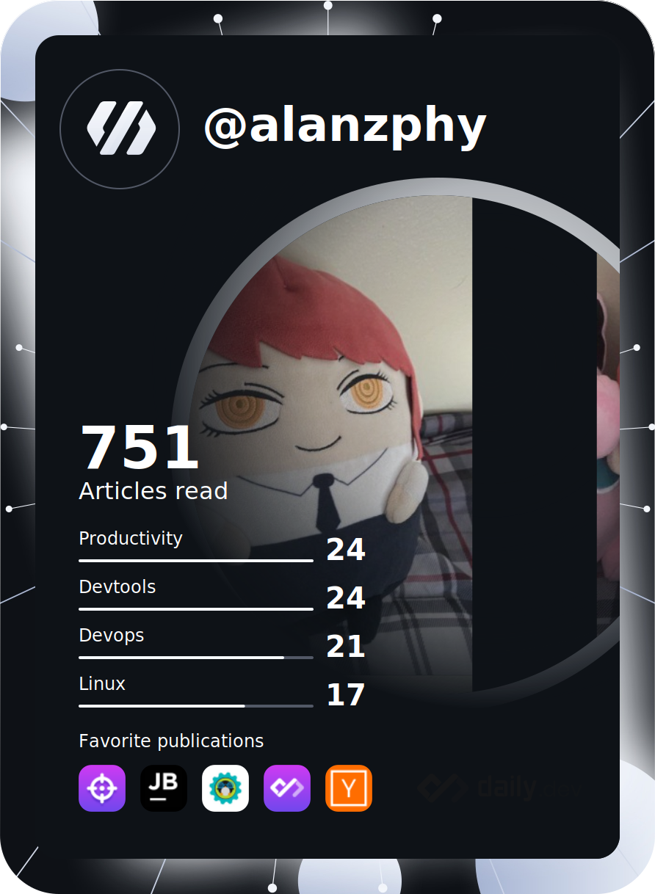

# ∼ About Me ∼ ☀️ 
### Hi, I'm Alan from Mexico and i started to learn about software as an self-taught since 1 year ago, currently I'm 18 years old.
 
 - 👨🏻‍💻 I’m currently learning English Grammar.
- ⚡ I like learning about Cloud Computing | DevOps | Web Development |
- 🎈 Interested in reading about Web 3
- 💻 I use Linux as main SO to explore about new ways of deployment, implementation, production and software creation 

  <a href="https://www.linkedin.com/in/alanruizs/" target="_blank" ><a/>
  <a href="https://twitter.com/Alanzphy" target="_blank"><a/>
  <a href="mailto:alanzphy@gmail.com" target="_blank"> <a/>
  <a href="https://www.instagram.com/alanzphy/" target="_blank" ><a/>
  
   

 

<!--   -->
    
# ∼ Tech Stack ∼ 🖥️
 

       
     
    
  
  
  
  
       
  
 
 

          

  
   
  
# ∼ Stats ∼ 📊
   

  
🌊  GitHub Stats

  

  
🌫 Most Used Languages

 

---
 
 
 

 
<!--   -->
 
<!--  -->
 

### `We want to use the popular paperback model whereby the author is responsible for making himself clear and not the academic model where it is the scholar’s job to dig the meaning out of the paper."` - _Robert C. Martin_

      

