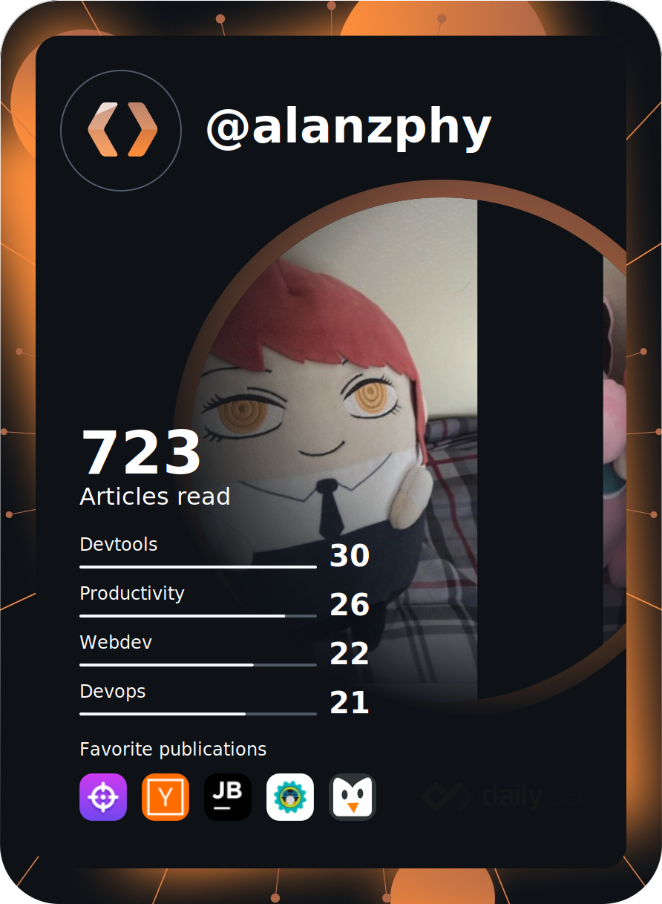

# ~/  
 


<!--  
[](https://github.com/ellerbrock/open-source-badges/)
-->


```yaml
"$ref": "alanz://schema/io.k8s.api.apps.v19.deploymentstatus"

apiVersion: v19
kind: Person 🧑‍🦱
metadata:
  name: Alan Ruiz
  role: SysAdmin
  replicas: 1
  image: /Alanzphy/README:v19
spec:
  description: Craft and improve environments for the best workflow 🔧
  tools:
    - Go
    - Bash
    - Python
    - Docker
    - Kubernetes
  languageSpoken:
    - es_MX 🇲🇽
    - en_US 🌎
  locations:
    - type: Twitter
        where: https://twitter.com/Alanzphy
    - type: Linkedin
        where: https://www.linkedin.com/in/alanruizs/
    - type: Discord
        where: Alanzphy#0213 || alanzphy.
```
 


 

<div>
<!--   -->
  <div align="center" style="display: inline_block">
    <a href="https://www.linkedin.com/in/alanruizs/" target="_blank" ><a/>
  <a href="mailto:alanzphy@gmail.com" target="_blank"> <a/>

  
  <div/>
<div/>

    

   

  
<br><br>
  

<div align="center" >
  <a href="https://github.com/alanzphy">


<div/>
 

<div>
 
<!--  

 <div>
   <a href="https://github.com/alanzphy">   
  
  
 <div/>
 📊 Stats
 🖥️ Tech Stack 

 -->
 
<!-- <a href="https://app.daily.dev/Alanzphy"></a> -->


<div/>


      

